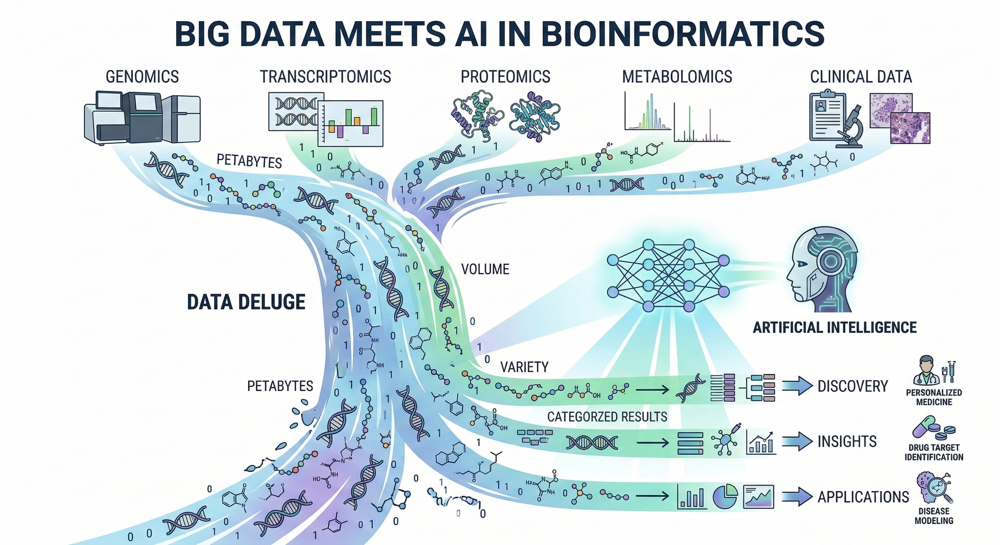
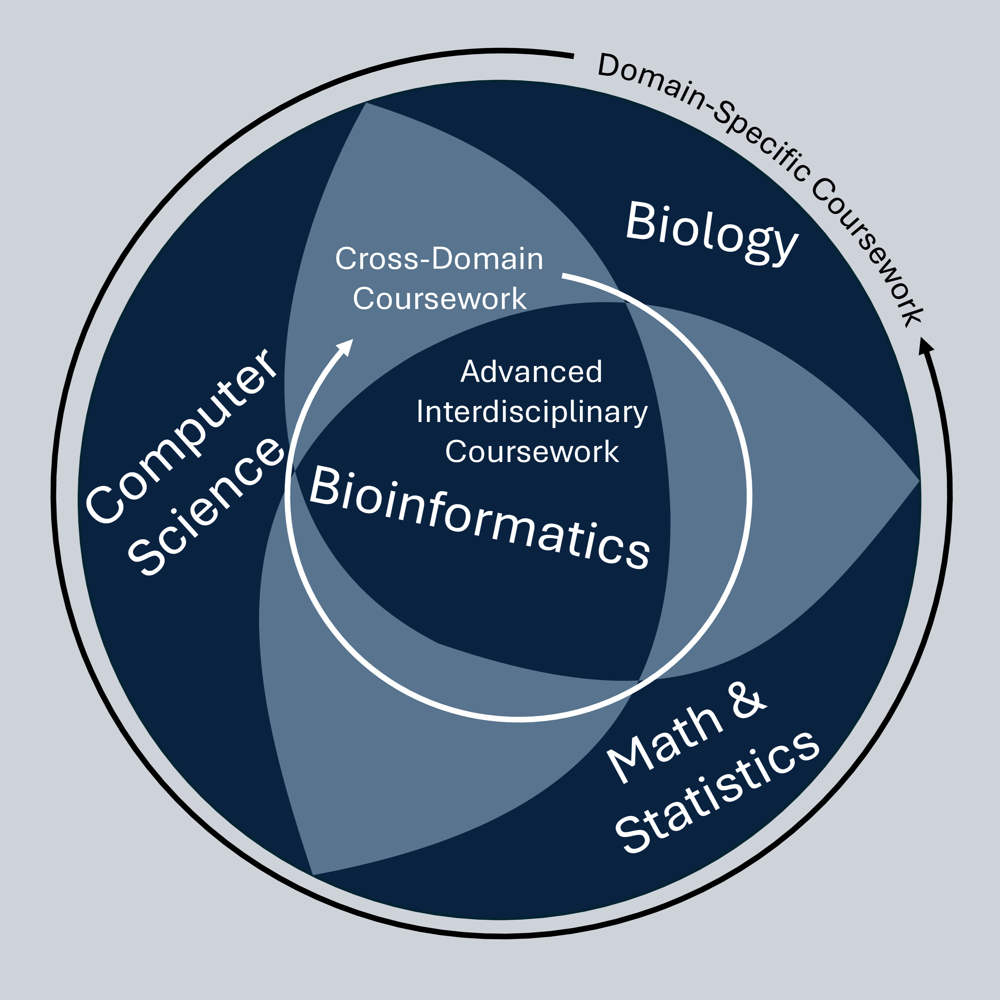
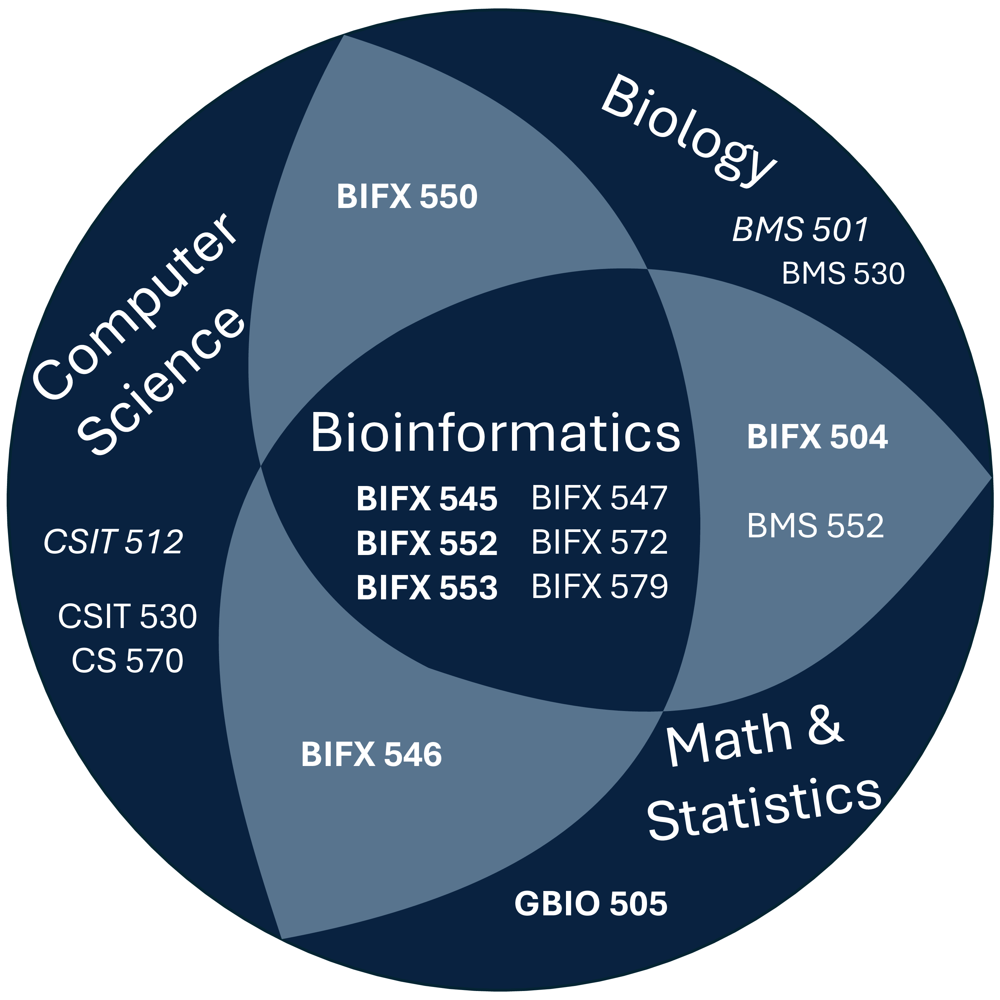
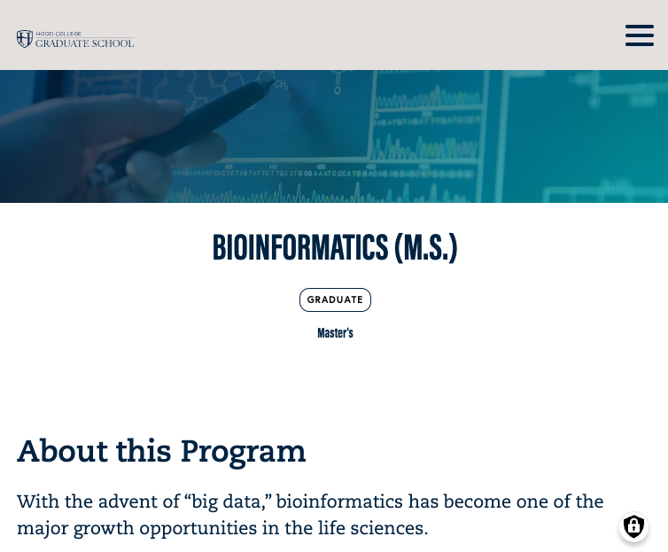

## Why bioinformatics now?

<!--
* We're generating unprecedented volumes of biological data from technologies like next-gen sequencing and proteomics

* **Traditional biological methods can't keep pace**

* From Human Genome Project (completed 2003) to AI-in-the-loop analysis of multiomics data (2025)
-->

## Interdisciplinary Approach

{width=50%}

## Where to Graduates Find Jobs?

<!--
* AI is proving to be a major disruptor in many fields
* The demand for skilled bioinformaticians is robust across diverse sectors
* What employers will want is someone who
  * understands the science behind the data
  * how to leverage AI and other computational tools to get work done
  * and what the results mean in the context of the science
* This is what we focus on teaching at Hood
-->

* Leading Industries:
  * Government & Academia
  * Pharmaceuticals & Biotechnology
  * Healthcare
  * Software Development & Infrastructure Support
  * (Agricultural & Environmental Science)

## Our Program

<!-- generation:
-   Export PowerPoint to Adobe pdf
-   magick -density 400 BIFXprogram.pdf -quality 100 BIFXprogram.png
-   Crop BIFXprogram.png
-->

[{width=55%}](https://hood.edu/BIFX)

## Capstone Examples

 - Infographic courtesy of Gemini](img/HPVtyping.png)

## Capstone Examples

 - Infographic courtesy of Gemini](img/QCdrift.png)

## Capstone Examples

 - Infographic courtesy of Gemini](img/somapower.png)

## Website

[{width=60%}](https://hood.edu/BIFX)

## Questions?

**Dr. Randy Johnson**

Bioinformatics Program Director

johnson@hood.edu

